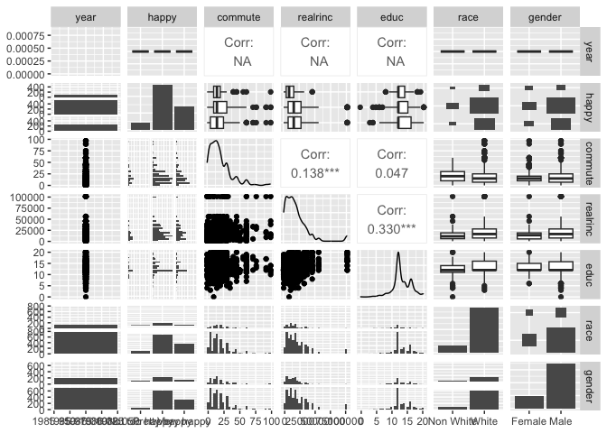
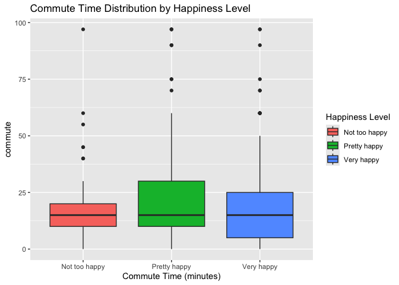
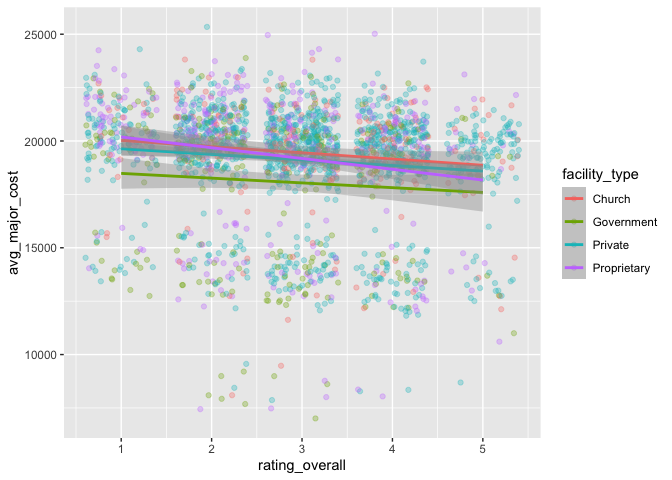
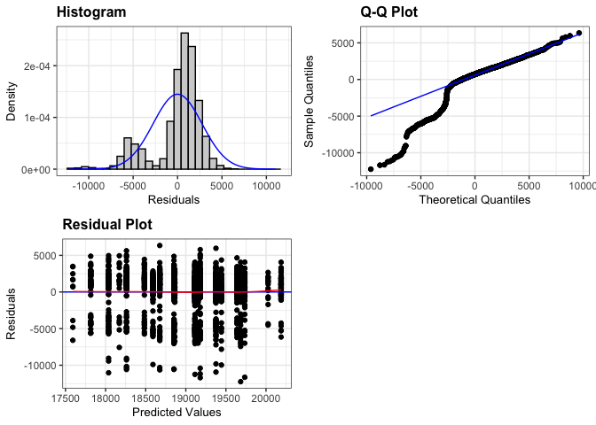
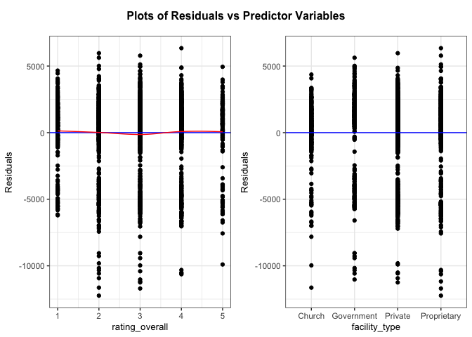

Data obtained from
[CORGIS](https://corgis-edu.github.io/corgis/csv/hospitals/); you can
also access from
[here](https://data.cms.gov/provider-data/?redirect=true).

## Data Wrangling

The `avg_major_cost` is the average of the four procedures listed.

``` r
hospital <- read_csv(file = "hospitals.csv") %>% 
  janitor::clean_names() %>% 
  mutate(avg_major_cost = rowMeans(across(c(procedure_heart_attack_cost, 
                                          procedure_heart_failure_cost, 
                                          procedure_pneumonia_cost, 
                                          procedure_hip_knee_cost)), 
                                          na.rm = TRUE))

hospital_dat <- hospital %>%
  dplyr::select(-facility_name, -facility_city, -facility_state, -(13:24)) %>%
  filter(avg_major_cost != 0, rating_overall > 0, facility_type != "Unknown") %>%
  mutate(across(where(is.character), ~ str_replace_all(., "None", NA_character_))) %>% 
  drop_na()
```

## EDA

``` r
ggplot(data = hospital_dat, aes(x = facility_type, y = rating_overall)) + 
  geom_boxplot()
```

<!-- -->

``` r
ggplot(data = hospital_dat, aes(x = rating_overall, fill = facility_type)) +
  geom_bar(position = "stack") +
  labs(x = "Rating Overall", y = "Count", fill = "Facility Type")
```

<!-- -->

``` r
ggplot(data = hospital_dat, 
       aes(x = rating_overall, y = avg_major_cost, color = facility_type)) + 
  geom_point(alpha = 0.3, position = position_jitter()) +
  geom_smooth(method = "lm")
```

<!-- -->

## OLS

``` r
cost_lm <- lm(avg_major_cost ~ rating_overall*facility_type, 
              data = hospital_dat)
summary(cost_lm)
```

    ## 
    ## Call:
    ## lm(formula = avg_major_cost ~ rating_overall * facility_type, 
    ##     data = hospital_dat)
    ## 
    ## Residuals:
    ##      Min       1Q   Median       3Q      Max 
    ## -12240.8   -474.6    709.5   1676.7   6345.0 
    ## 
    ## Coefficients:
    ##                                         Estimate Std. Error t value Pr(>|t|)
    ## (Intercept)                             20316.36     555.95  36.544   <2e-16
    ## rating_overall                           -290.77     167.13  -1.740   0.0820
    ## facility_typeGovernment                 -1609.91     705.31  -2.283   0.0226
    ## facility_typePrivate                     -416.72     605.20  -0.689   0.4912
    ## facility_typeProprietary                  375.89     657.32   0.572   0.5675
    ## rating_overall:facility_typeGovernment     67.79     223.73   0.303   0.7619
    ## rating_overall:facility_typePrivate        28.92     182.41   0.159   0.8740
    ## rating_overall:facility_typeProprietary  -213.48     207.24  -1.030   0.3031
    ##                                            
    ## (Intercept)                             ***
    ## rating_overall                          .  
    ## facility_typeGovernment                 *  
    ## facility_typePrivate                       
    ## facility_typeProprietary                   
    ## rating_overall:facility_typeGovernment     
    ## rating_overall:facility_typePrivate        
    ## rating_overall:facility_typeProprietary    
    ## ---
    ## Signif. codes:  0 '***' 0.001 '**' 0.01 '*' 0.05 '.' 0.1 ' ' 1
    ## 
    ## Residual standard error: 2758 on 2096 degrees of freedom
    ## Multiple R-squared:  0.03699,    Adjusted R-squared:  0.03377 
    ## F-statistic:  11.5 on 7 and 2096 DF,  p-value: 2.115e-14

``` r
resid_panel(cost_lm, plots = c("hist", "qq", "resid"), smoother = T)
```

<!-- -->

``` r
resid_xpanel(cost_lm, smoother = T)
```

<!-- -->
